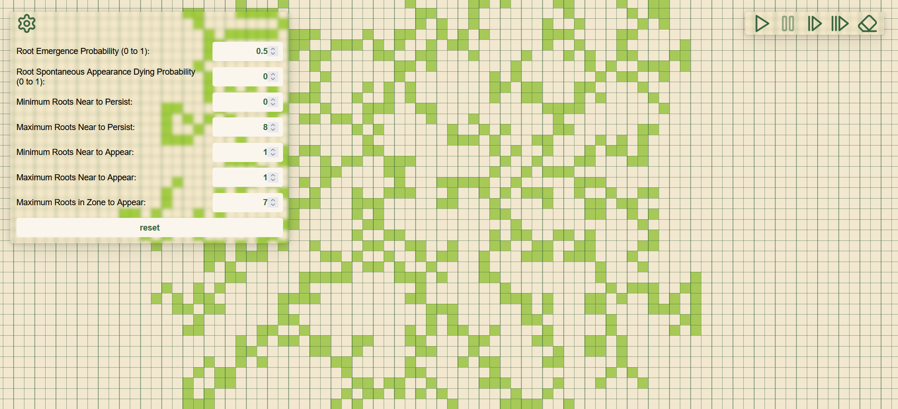

# Root Propagation Cellular Automaton

Ce projet vise à simuler la croissance et la propagation des racines dans une grille à l'aide d'automate cellulaire. 
Le projet utilise JavaScript pour la simulation et le rendu graphique sur un canvas HTML.

## Fonctionnalités
- Simulation de la propagation des racines dans une grille.
- Paramétrage des différentes régles d'apparition et de disparition.
- Contrôle de la simulation via une interface utilisateur pour lancer, mettre en pause, avancer d'un pas ou de 10 pas, et réinitialiser la simulation.
- Zoom et déplacement dans la grille via des interactions souris (molette et click gauche).
- Ajout et suppression des racines avec le click droit.

## Lancement
- Visiter la page héberger par github : https://florentmoulon.github.io/Forest-Cellular-Automaton/

## Utilisation

### Contrôles
- **Play :** Lance la simulation.
- **Pause :** Met en pause la simulation.
- **Step :** Avance la simulation d'un pas.
- **Step 10 :** Avance la simulation de 10 pas.
- **Clear :** Réinitialise la grille.
- **Zoom :** Utilisez la molette de la souris pour zoomer et dézoomer.
- **Déplacement :** Cliquez et faites glisser la souris pour déplacer la grille.

### Paramètres
- **Probabilité d'émergence des racines :** Contrôle la probabilité qu'une nouvelle racine émerge.
- **Probabilité de mort spontanée des racines :** Contrôle la probabilité qu'une racine meure spontanément.
- **Nombre minimum de racines proches pour persister :** Détermine combien de racines voisines sont nécessaires pour qu'une racine persiste.
- **Nombre maximum de racines proches pour persister :** Détermine combien de racines voisines sont tolérées pour qu'une racine persiste.
- **Nombre minimum de racines proches pour apparaître :** Détermine combien de racines voisines sont nécessaires pour qu'une nouvelle racine apparaisse.
- **Nombre maximum de racines proches pour apparaître :** Détermine combien de racines voisines sont tolérées pour qu'une nouvelle racine apparaisse.
- **Nombre maximum de racines dans la zone pour apparaître :** Détermine combien de racines voisines sont tolérées dans une zone plus large pour qu'une nouvelle racine apparaisse.

## Exemple

## Architecture du Code
- index.html : Contient la structure HTML et le canvas pour le rendu.
- style.css : Contient les styles CSS pour l'interface utilisateur.
- script.js : Contient toute la logique de la simulation, les classes pour les cellules, l'espace, et le système de dessin sur le canva.